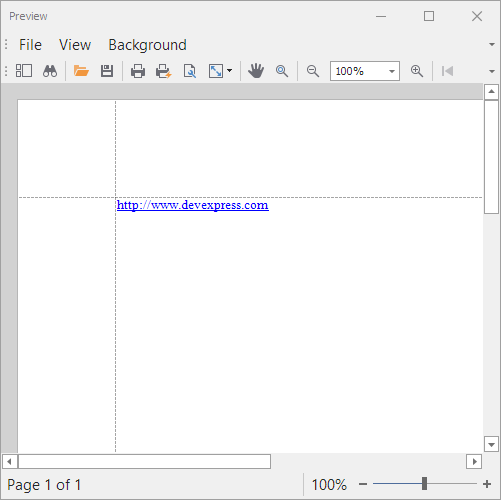
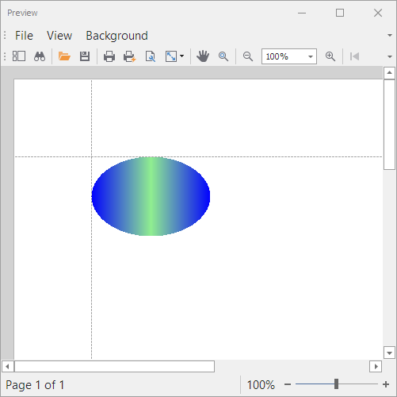

<!-- default badges list -->

<!-- default badges end -->
# Reporting for WinForms - How to Create a Custom Brick  

This example demonstrates how to inherit from existing Brick classes to create custom bricks.

The **HyperLinkBrick** brick inherits from the [TextBrick](https://docs.devexpress.com/CoreLibraries/DevExpress.XtraPrinting.TextBrick) class.

The **EllipseBrick** brick inherits from the [Brick](https://docs.devexpress.com/CoreLibraries/DevExpress.XtraPrinting.Brick) class and requires a  `DevExpress.XtraPrinting.BrickExporters.BrickExporter` descendant that implements a method to draw a brick.

## Files to Look At

- [Form1.cs](./CS/Form1.cs) (VB: [Form1.vb](./VB/Form1.vb))
- [MyBrick.cs](./CS/MyBrick.cs) (VB: [MyBrick.vb](./VB/MyBrick.vb))

## Documentation

- [Bricks](https://docs.devexpress.com/WindowsForms/88/controls-and-libraries/printing-exporting/concepts/basic-terms/bricks)

## More Examples

- [How to use a custom BrickExporter](https://github.com/DevExpress-Examples/Reporting_how-to-use-custom-brickexporter-e2892)
- [How to scroll a document in the print preview to a specific page or brick](https://github.com/DevExpress-Examples/Reporting_how-to-scroll-a-document-in-the-print-preview-to-a-specific-page-or-brick-e2386)

